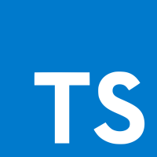
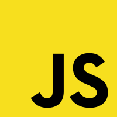
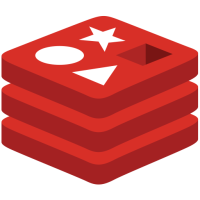
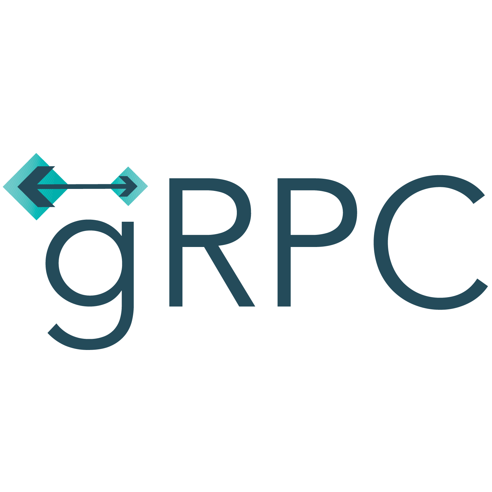
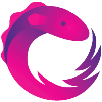
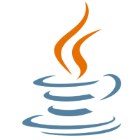

# 프로젝트

프로젝트 별 링크를 통해 세부 정보를 확인할 수 있습니다

- [2020](#2020)
- [2019](#2019)
- [2018](#2018)
- [2017](#2017)
- [2013](#2013)

## 2020

### [JetCard](https://github.com/namhyun-gu/namhyun-gu/blob/master/projects/jetcard.md)

  
  

- 2020.11
- Jetpack Compose를 이용하여 개발한 플래시카드 애플리케이션
- 기술 : Jetpack Compose / Dagger Hilt / Coroutines / Room
- 아키텍처 : MVVM

### [repo-watcher]()

  

- 2020.08 ~ 2020.10
- Repository에 업데이트 된 커밋 내용을 메일을 통해 받을 수 있도록 하는 서비스
- 기술 : Github Actions, nodemailer

### [geo-key](https://github.com/namhyun-gu/namhyun-gu/blob/master/projects/geo-key.md)

  
  

- 2020.06
- 위치를 기반으로 키를 저장하고, 저장한 키를 관리할 수 있는 애플리케이션
- 기술 : Dagger Hilt, Coroutines, Firebase, Naver Map
- 아키텍처 : MVVM

### [intent-contract](https://github.com/namhyun-gu/namhyun-gu/blob/master/projects/intent-contract.md)

  

- 2020.06
- 타입에 안전한 `Intent` 사용을 위해 개발한 라이브러리
- 기술 : Annotation Processor

## 2019

### [mapp](https://github.com/namhyun-gu/namhyun-gu/blob/master/projects/mapp.md)

  

- 2019.10 - 2019.12
- 임베디드 소프트웨어 수업의 팀 프로젝트로 진행
- 셀럽, 프로그램에 따른 맛집을 소개하고, 리뷰를 작성할 수 있는 애플리케이션
- 맡은 부분
  - 메인 화면 내 셀럽, 프로그램 리스트 및 알림 리스트
  - 셀럽, 프로그램 내용의 자동완성을 포함한 검색 기능
  - 즐겨찾기한 맛집에 새 리뷰가 작성될 때 알림을 전달하는 기능
- 기술 : Koin (DI), Coroutine, Room database, Firebase, Naver Map
- 아키텍처 : MVVM

### [contest-crawler-bot](https://github.com/namhyun-gu/namhyun-gu/blob/master/projects/contest-crawler-bot.md)

  
  

- 2019.07
- 공모전 정보를 크롤링하고 업데이트 된 공모전 정보를 텔레그램 봇을 통해 알려주는 서비스
- 기술 : Express, Telegram Bot API, Firebase

## [fill-memo](https://github.com/namhyun-gu/namhyun-gu/blob/master/projects/fill-memo.md)

  
  
  (App, Web)
  
  
  
  (Auth Server)

- 2019.01 ~ 2019.11
- 졸업 프로젝트로 진행한 프로젝트
- 서식 있는 텍스트 및 마크다운을 통한 메모 작성을 지원하며 동기화 가능하고 웹/앱(single codebase)을 지원
- 맡은 부분
  - 메인 화면 내 메모 그리드, 리스트
  - 메모를 분류할 수 있는 폴더 기능
  - [서식 있는 텍스트 에디터](https://github.com/namhyun-gu/flutter_rich_text_editor)
  - 동기화 기능 제공에 있어 세션 공유를 위한 인증 서버
  - 개발된 App을 Web에 호환되도록 마이그레이션
- 기술
  - App, Web : Flutter, Firebase, gRPC
  - Auth Server : gRPC, Redis
- 아키텍처
  - App, Web : BLoC
## 2018

### [SceneSpotInSeoul](https://github.com/namhyun-gu/namhyun-gu/blob/master/projects/SceneSpotInSeoul.md)

  
  (App)
  
  
  
  (Server)
  
  
  (DB 관리 페이지)

- 2018.09
- 서울시 앱공모전 2018에 참여한 프로젝트
- 드라마, 영화 등 미디어의 촬영지 정보를 제공하고 해당 장면과 동일한 사진을 찍을 수 있도록 도와주는 애플리케이션
- 맡은 부분
  - 메인 화면 내 미디어, 장소, 장면별 리스트
  - 자동완성을 포함한 앱 내 컨텐츠 검색
  - 앱 내 내부 DB와 서버 DB를 동기화하는 기능
  - 서버 (AWS lambda) 및 DB 관리 페이지 (React) 구현
- 기술
  - App : Android Architecture Component (AAC), Room Database
  - Server : Serverless framework, AWS lambda, AWS dynamoDB
  - DB 관리 페이지 : React

## 2017

### [BitcoinSimulator](https://github.com/namhyun-gu/namhyun-gu/blob/master/projects/BitcoinSimulator.md)

  
  

- 2017.12
- Bithumb 비트코인 시세 API를 활용하여 비트코인 투자를 시뮬레이션 해볼 수 있는 애플리케이션
- 기술 : Android Architecture Component, RxJava, Realm Database
- 아키텍처 : MVVM

## 2013

### [MealViewer](https://github.com/namhyun-gu/namhyun-gu/blob/master/projects/MealViewer.md)

  
  

- 2013.08 ~ 2017.05
- Neis 서비스의 학교 급식 정보를 제공하는 애플리케이션
- Play Store에 게시한 애플리케이션
- 5,000명정도의 다운로드 수, 4.4점의 평점 기록
- 기술 : Dagger 2, RxJava, Realm Database
- 아키텍처 : MVP
- [Play Store 바로가기](https://play.google.com/store/apps/details?id=com.earlier.yma&pcampaignid=MKT-Other-global-all-co-prtnr-py-PartBadge-Mar2515-1)