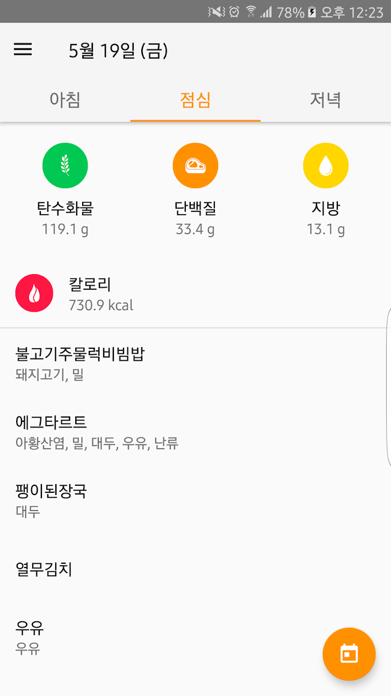
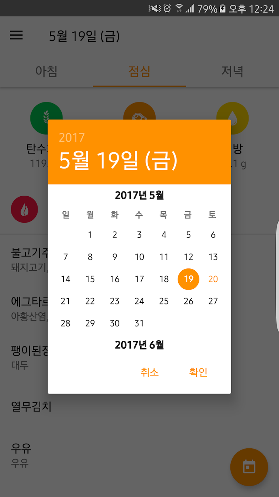

# MealViewer

Neis 서비스의 학교 급식 정보를 제공하는 애플리케이션입니다. 플레이스토어에 처음 게시해본 애플리케이션이며, 5,000명정도의 다운로드 수, 4.4점의 평점을 기록하였습니다.

- [바로가기](#바로가기)
- [프로젝트 정보](#프로젝트-정보)
  - [언어](#언어)
  - [기술](#기술)
  - [아키텍처](#아키텍처)
- [노트](#노트)
- [스크린샷](#스크린샷)


## 바로가기

- [Github](https://github.com/namhyun-gu/MealViewer)
- [Play Store](https://play.google.com/store/apps/details?id=com.earlier.yma&pcampaignid=MKT-Other-global-all-co-prtnr-py-PartBadge-Mar2515-1)

## 프로젝트 정보

### 언어

- Java

### 기술

- **Dagger 2**
- **RxJava**
- Retrofit
- Realm Database

### 아키텍처

- **MVP**

## 노트

이 프로젝트는 처음 개발이 이루어질 때 어떠한 아키텍처 패턴을 적용하지 않고 개발이 되었습니다.
기능 개선과 추가 과정에서 Activity 하나에서 모든 것을 처리하는 방식에서는 코드를 읽기도 어려웠고 관리하기가 까다로웠던 문제가 있어 처음으로 MVP 패턴을 적용하였습니다.

MVP 패턴을 적용한 이후, 참여했던 개발자 행사에서 Dagger를 이용하면 좋다라는 이야기만 듣고 Dagger를 적용한 프로젝트로 이 프로젝트에서 DI와 아키텍처 패턴이 처음으로 이용되었습니다.

이 프로젝트에서 RxJava는 네트워크 처리를 위한 AsyncTask를 대체하고, 다음과 같이 로컬에 저장된 캐시가 있다면 저장된 캐시를 제공하는 로직을 구현할 때 사용되었습니다.

```java
@Override
public void loadData() {
  MealPreferences.SchoolInfo info = MealPreferences.getSchoolInf(mContext);

  int type = mCurrentFiltering.ordinal() + 1;

  if (info == null) {
    mView.showSetupDialog();
    return;
  }

  mView.updateTitle(mCurrentDate);

  Observable<Meal> local = mRepository.getLocalData(mCurrentDate, type);
  Observable<Meal> server = mRepository.getServerData(info,mCurrentDate, type);

  Observable.concat(local, server)
      .firstElement()
      .doOnSubscribe(disposable -> mView.showProgress())
      .subscribe(meal1 -> {
            if (!meal1.getMealList().isEmpty()) {
              mView.showMeal(meal1);
            } else {
              mView.showNoMeal(meal1.getTimestamp());
            }
          },
          throwable -> {
            if (throwable instanceof UnknownHostException) {
              Log.e(TAG, "loadData: Network Error", throwable);
              mView.showNetworkError();
            } else {
              Log.e(TAG, "loadData: Error occurred", throwable);
              mView.showUnknownError();
            }
          });
}
```

## 스크린샷


