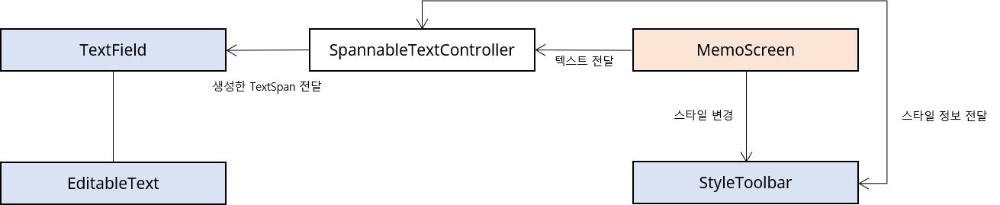

# fill-memo

졸업 프로젝트로 진행한 프로젝트로 메모의 형식으로 서식 있는 텍스트, 마크다운을 지원하고 외부 로그인 서비스 없이 여러 기기에서 동기화하여 이용할 수 있는 **웹/앱**입니다.

## 바로가기

- [Github - Client](https://github.com/smu-gp/fill-memo)
- [Github - Auth Server](https://github.com/smu-gp/sp-auth-server)

## 프로젝트 정보

### 언어

- Client : Dart
- Auth Server : Go

### 기술

- Client
  - Flutter
  - Firebase (Cloud Firestore, Auth, Crashlystics)
  - gRPC

- Auth Server
  - gRPC
  - Redis

### 아키텍처

- Client : BLoC

## 맡은 부분

- 메인 (메모 리스트)
- 폴더 기능
- 서식 있는 텍스트 메모
- 세션 공유를 위한 인증 서버
- 개발한 앱을 웹으로 마이그레이션

## 노트

이 프로젝트는 졸업 프로젝트로 진행했으며 처음으로 Flutter을 사용하여 애플리케이션을 개발해봤습니다.

프로젝트를 진행하며 서식 있는 텍스트 메모 기능을 구현하는 것이 가장 어려운 과제였으며 메모 기능 구현을 위해
Flutter의 TextField 동작 과정을 소스코드 분석을 통해 알아냈고 다음과 같은 설계로 구현했습니다.

프로젝트에 세선 공유를 통한 2단계 인증 서버도 구현하였는데 이때 Go언어와, gRPC, Redis를 활용하여 개발했으며
인증 과정은 다음과 같은 방식으로 진행됩니다.

1. 연동을 요청하는 Host가 세션 정보를 서버에 전달합니다. (WaitAuth 요쳥)
2. 세션 정보에 따른 연동을 위한 6자리 코드가 Host에게 전달됩니다. (WaitAuth 응답)
3. 서버는 해당 코드를 Redis의 PubSub를 통해 해당 키를 구독합니다.
4. 연동하려는 Guest는 Host에게 확인한 코드와 기기 정보를 서버에게 전달합니다. (Auth)
5. 서버는 Guest의 요청에 따라 해당 코드의 Subscriber에 Publish 이벤트를 전달합니다.
6. 서버의 Subscriber는 Host에게 Guest의 디바이스 정보를 제공하고 허용할 것인지를 묻습니다
   1. Host가 거절하면, Host는 서버에게 거절 응답을 보내고 WaitAuth 채널을 닫습니다
   2. Host가 승인하면, Host는 서버에게 승인 응답을 보내고 WaitAuth 채널을 닫습니다.
7. Host가 승인했다면, Guest에게 Auth 채널을 통해 Host의 세션 정보가 전달됩니다.

다음은 위 과정에 대해 개발 시 만들었던 시퀀스 다이어그램입니다.

## 스크린샷

- Rich Text Editor

- Markdown

- Connection

