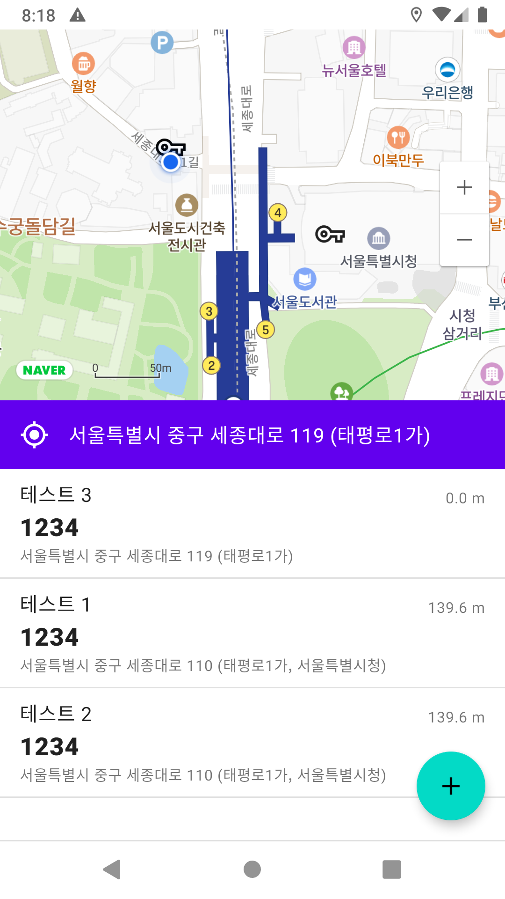
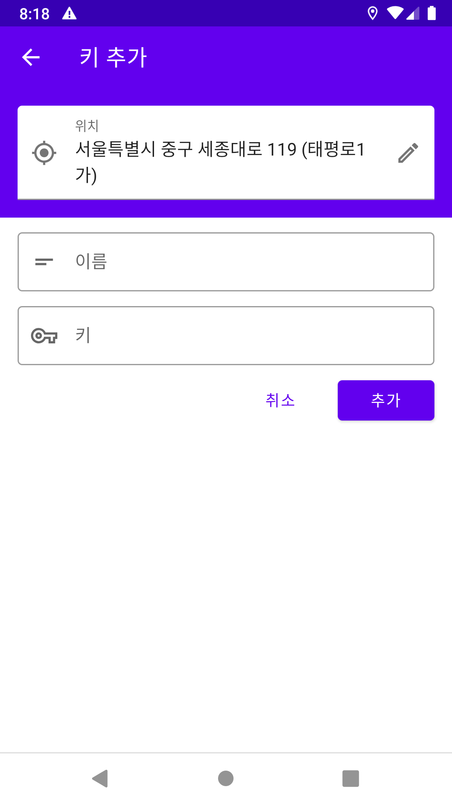
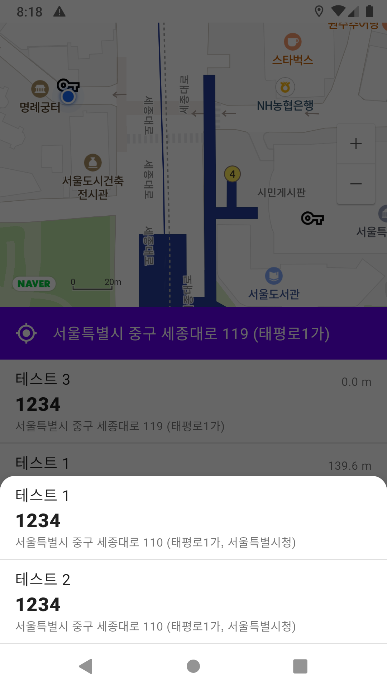

# geo-key

위치를 기반으로 키를 저장하고, 저장한 키를 관리할 수 있는 애플리케이션입니다.

- [바로가기](#바로가기)
- [프로젝트 정보](#프로젝트-정보)
  - [언어](#언어)
  - [기술](#기술)
  - [아키텍처](#아키텍처)
- [노트](#노트)
- [스크린샷](#스크린샷)


## 바로가기

- [Github](https://github.com/namhyun-gu/geo-key)

## 프로젝트 정보

### 언어

- Kotlin

### 기술

- **Dagger Hilt**
- **Coroutine**
- kotlinx.serialization
- Retrofit
- Firebase
  - Cloud Firestore
  - Firebase Auth
- Naver Map

### 아키텍처

- **MVVM, Clean Architecture**

## 노트

이 프로젝트는 전부터 사용하던 MVVM 아키텍처가 올바른지 매번 고민했었는데 이를 해소하고자 찾게된 [google/iosched](https://github.com/google/iosched) 프로젝트에 영향을 받아 Clean Architecture 와 MVVM 패턴, Coroutine를 이용하여 개발한 프로젝트입니다.

프로젝트는 Clean Architecture의 Presenter, Domain, Data Layer를 따라 다음과 같이 설계되었습니다.


UseCase들은 지속적으로 데이터를 전달하는 경우와 그렇지 않은 경우에 따라 구분한 FlowUseCase와 UseCase를 사용하며, Dagger Hilt를 통해 ViewModel에 주입하여 서비스의 기능들을 구현합니다.

현재 이 앱은 Jetpack Compose를 이용하여 다시 개발되고 있습니다.

- UseCase 예시 ([GetAddressUseCase.kt](https://github.com/namhyun-gu/geo-key/blob/master/app/src/main/java/dev/namhyun/geokey/domain/location/GetAddressUseCase.kt))

```kotlin
class GetAddressUseCase @Inject constructor(
    private val geocodingService: GeocodingService,
    @IoDispatcher ioDispatcher: CoroutineDispatcher
) : UseCase<LocationModel, String>(ioDispatcher) {
    override suspend fun execute(parameters: LocationModel): String {
        val coords = "${parameters.lon},${parameters.lat}"
        val address = geocodingService.reverseGeocode(
            BuildConfig.NCP_CLIENT_ID,
            BuildConfig.NCP_CLIENT_SECRET,
            coords
        ).getAddress()
        return address ?: ""
    }
}
```

- FlowUseCase ([GetLocationsUseCase.kt](https://github.com/namhyun-gu/geo-key/blob/master/app/src/main/java/dev/namhyun/geokey/domain/location/GetLocationsUseCase.kt))

```kotlin
@ExperimentalCoroutinesApi
class GetLocationsUseCase @Inject constructor(
    private val locationDataSource: LocationDataSource,
    @MainDispatcher mainDispatcher: CoroutineDispatcher
) : FlowUseCase<Unit, LocationModel>(mainDispatcher) {
    override fun execute(parameters: Unit): Flow<Result<LocationModel>> {
        return flow {
            emit(Result.Success(locationDataSource.getLastLocation()))
            locationDataSource.getLocationUpdates().collect {
                emit(Result.Success(it))
            }
        }
    }
}
```

- ViewModel ([MainViewModel.kt](https://github.com/namhyun-gu/geo-key/blob/master/app/src/main/java/dev/namhyun/geokey/ui/main/MainViewModel.kt))

```kotlin
@ExperimentalCoroutinesApi
class MainViewModel @ViewModelInject constructor(
    getKeysUseCase: GetKeysUseCase,
    getLocationsUseCase: GetLocationsUseCase,
    getAddressUseCase: GetAddressUseCase
) : ViewModel() {
    val keys = liveData {
        emit(null)
        getKeysUseCase(Unit).collect {
            if (it.succeeded) {
                emit(it.data)
            }
        }
    }

    val location = liveData {
        emit(null)
        getLocationsUseCase(Unit).collect { locationResult ->
            when (locationResult) {
                is Result.Success -> {
                    when (val addressResult = getAddressUseCase(locationResult.data)) {
                        is Result.Success -> {
                            val (_, lat, lon) = locationResult.data
                            emit(LocationModel(addressResult.data, lat, lon))
                        }
                        is Result.Error -> {
                            Timber.e(addressResult.exception)
                        }
                    }
                }
                is Result.Error -> {
                    Timber.e(locationResult.exception)
                }
            }
        }
    }

}

```

## 스크린샷



