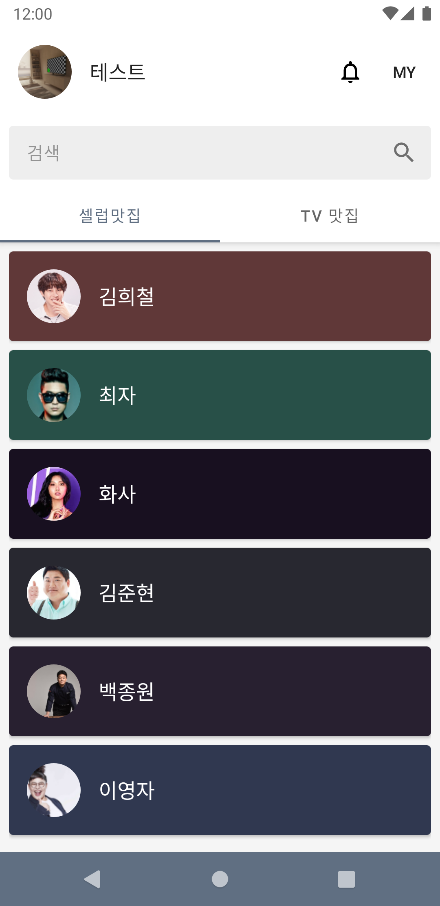
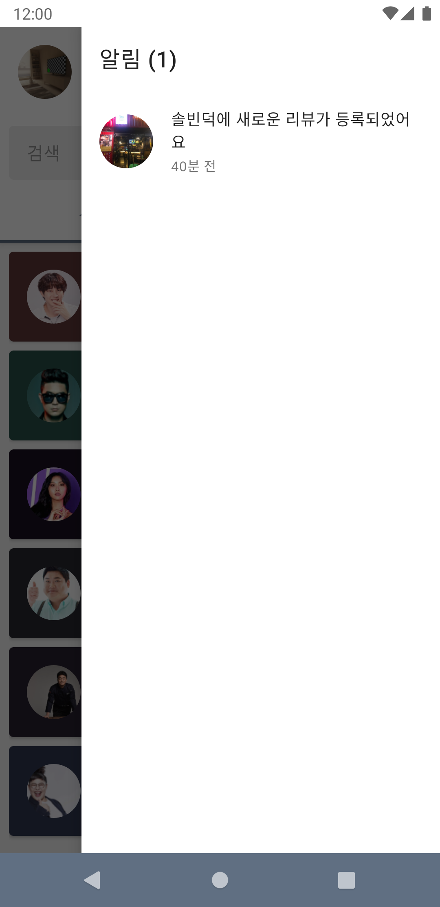
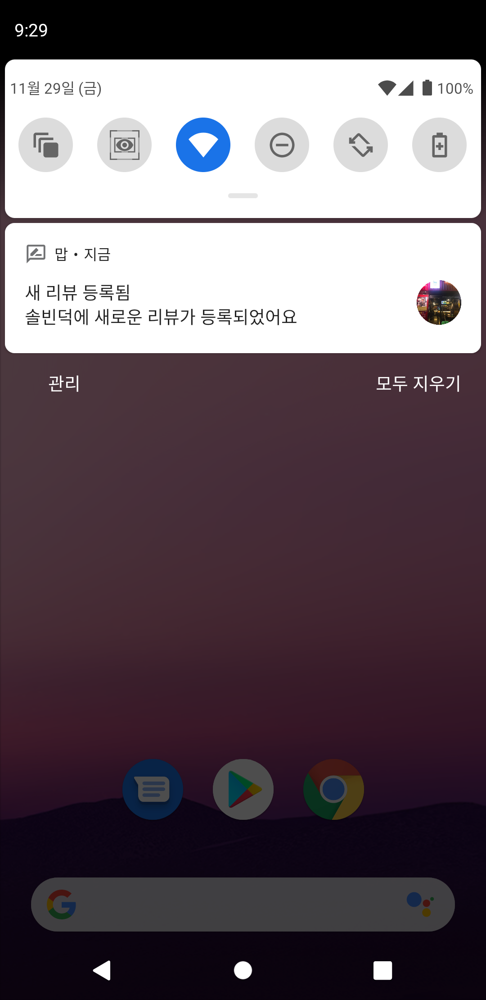
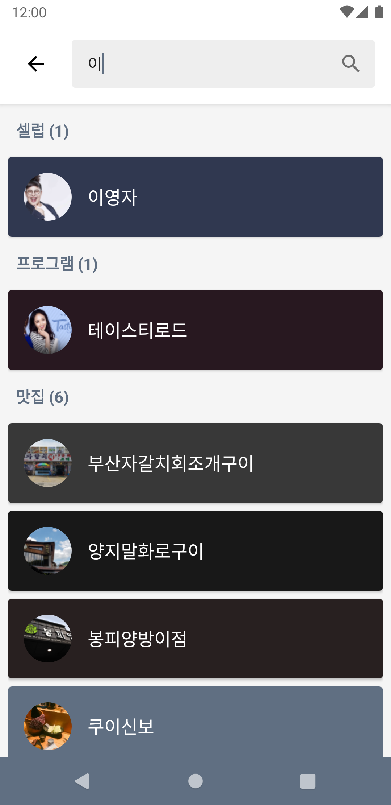
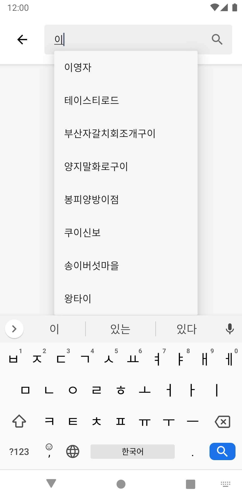
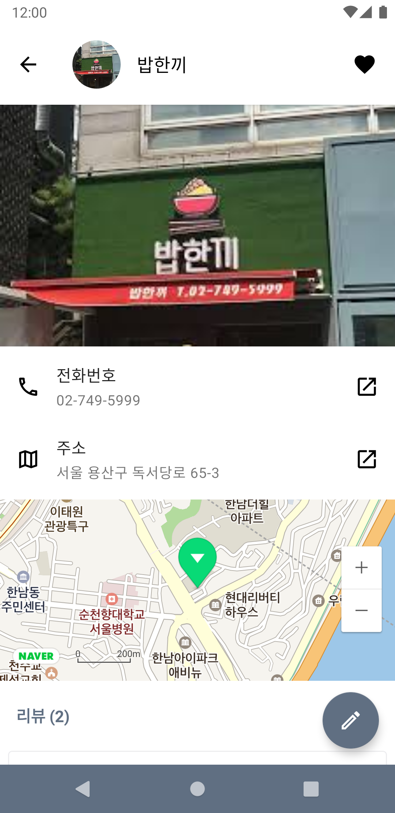
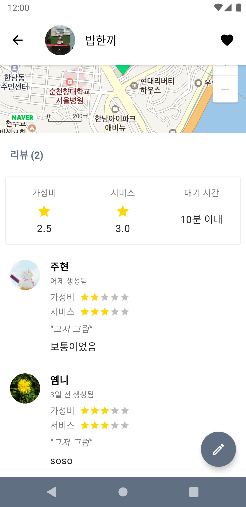
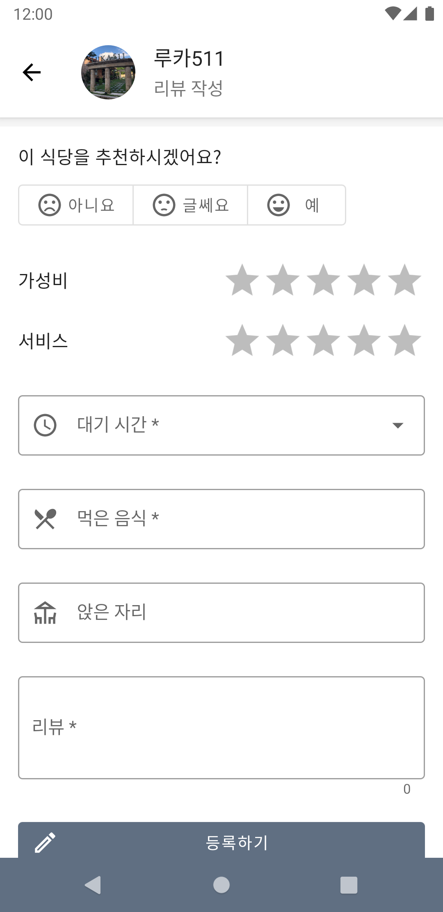
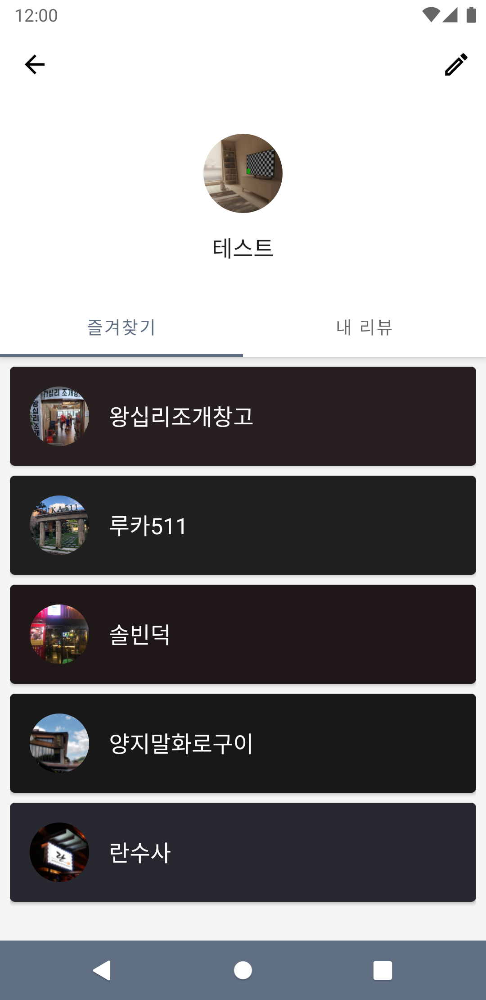

<h1 align="center">mapp</h1>

<p align="center">
임베디드 소프트웨어 수업의 팀 프로젝트로 맛집을 소개하는 애플리케이션입니다.
</p>

- [바로가기](#바로가기)
- [프로젝트 정보](#프로젝트-정보)
  - [언어](#언어)
  - [기술](#기술)
  - [아키텍처](#아키텍처)
- [맡은 부분](#맡은-부분)
- [노트](#노트)
- [스크린샷](#스크린샷)


## 바로가기

- [Github](https://github.com/team-mapp/mapp)

## 프로젝트 정보

### 언어

- Kotlin

### 기술

- **Coroutine**
- **Koin (DI)**
- Room database
- Naver Map
- Firebase (Cloud Firestore, Firebase Messaging, Firebase Auth, Firebase Storage)

### 아키텍처

- MVVM

## 맡은 부분

- 메인 (셀럽, 프로그램 리스트)
- 검색 기능 (자동완성 포함)
- 리뷰 알림 기능
- 프로젝트 아키텍처 설계

## 노트

이 프로젝트는 학교 수업의 팀 프로젝트로 진행되었던 프로젝트입니다.

저는 이 프로젝트에서 프로젝트 아키텍처 설계를 담당하여 프로젝트에 전부터 많이 활용했던 MVVM 패턴을 적용하였습니다.

팀원 다수가 안드로이드 프로젝트에 익숙하지 않는 점을 감안하여 데이터베이스를 쉽게 활용할 수 있도록 유틸리티 메소드, 클래스들을 작성하고 정기적인 모임을 통해 팀원들에게 이용하는 방법과 동작 방법에 대해 설명을 진행하며 프로젝트를 진행하였습니다. 이 과정을 통해 팀원들과의 첫 회의를 통해 구현하고자한 모든 기능들을 프로젝트 기한 내에 구현할 수 있었습니다.

이 프로젝트에서 Coroutine은 Firebase를 이용할 때 필요한 콜백 함수를 줄이는 데 주로 사용되었습니다.

- Query.asFlow()

```kotlin
@ExperimentalCoroutinesApi
fun Query.asFlow(): Flow<QuerySnapshot?> = callbackFlow {
    val listener = addSnapshotListener { snapshot, exception ->
        if (exception != null) {
            cancel(exception.toString(), exception)
        } else {
            offer(snapshot)
        }
    }
    awaitClose { listener.remove() }
}
```

- Repository 예시

> Query.await() 함수는 `org.jetbrains.kotlinx:kotlinx-coroutines-play-services` 라이브러리에 포함된 함수를 이용하였습니다.

```kotlin
class CelebsRepositoryImpl(private val db: FirebaseFirestore) : CelebsRepository {

    companion object {
        private const val COLLECTION_PATH = "celebs"
    }

    override suspend fun loadCelebs(): List<Celeb>? =
        db.collection(COLLECTION_PATH)
            .get().await()
            .toObject(::fromMap)

    @ExperimentalCoroutinesApi
    override fun loadCelebsSync(): Flow<List<Celeb>?> =
        db.collection(COLLECTION_PATH)
            .asFlow()
            .map { it?.toObject(::fromMap) }

    // ...

}
```

위에서 작성한 Repository의 코드를 통해 자동완성 검색 기능을 쉽게 구현할 수 있었습니다.

```kotlin
class SearchViewModel(
    private val celebsRepository: CelebsRepository,
    private val programsRepository: ProgramsRepository,
    private val restaurantsRepository: RestaurantsRepository
) : StateViewModel() {
    val searchResults: LiveData<SearchResult> = useState()
    val searchAutoComplete: LiveData<SearchResult> = useState()
    val showProgress: LiveData<Boolean> = useState()

    fun search(query: String, autoComplete: Boolean = false) {
        viewModelScope.launch {
            setState(showProgress, !autoComplete)
            val queryCelebs = celebsRepository.loadCelebsByQuery(query)
            val queryPrograms = programsRepository.loadProgramsByQuery(query)
            val queryRestaurants = restaurantsRepository.loadRestaurantsByQuery(query)
            setState(showProgress, false)
            if (autoComplete) {
                setState(
                    searchAutoComplete,
                    SearchResult(queryCelebs, queryPrograms, queryRestaurants)
                )
            } else {
                setState(searchResults, SearchResult(queryCelebs, queryPrograms, queryRestaurants))
            }
        }
    }
}
```

## 스크린샷

- 메인

<p align="left">
    
</p>

- 리뷰 알림

<p align="left">
    
    
</p>

- 검색

<p align="left">
    
    
</p>

- 식당 상세

<p align="left">
    
    
</p>

- 리뷰 작성

<p align="left">
    
</p>

- 프로필

<p align="left">
    
</p>