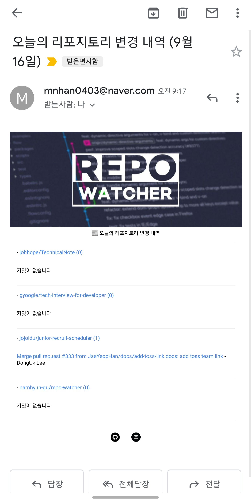

# repo-watcher

레포지토리에 업데이트 된 커밋 메시지들을 메일을 통해 받을 수 있는 서비스입니다.

- [바로가기](#바로가기)
- [프로젝트 정보](#프로젝트-정보)
  - [언어](#언어)
  - [기술](#기술)
- [노트](#노트)
- [스크린샷](#스크린샷)

## 바로가기

- [Github](https://github.com/namhyun-gu/repo-watcher)

## 프로젝트 정보

### 언어

- Typescript

### 기술

- nodemailer
- Github Actions

## 노트

이 프로젝트는 Github Actions의 Cron 기능을 통해 매일 오전 9시에 스크립트를 실행하고 사용자가 원하는 레포지토리의 업데이트 된 커밋 메시지를 가져옵니다.

뉴닉이라는 뉴스 메일링 서비스를 이용해보먼서 취업 준비에 도움이 되는 레포지토리의 업데이트 내용을 매일 아침마다 받으면 잊지 않고 확인하면 좋을 것 같아 개발한 프로젝트입니다.

## 스크린샷

